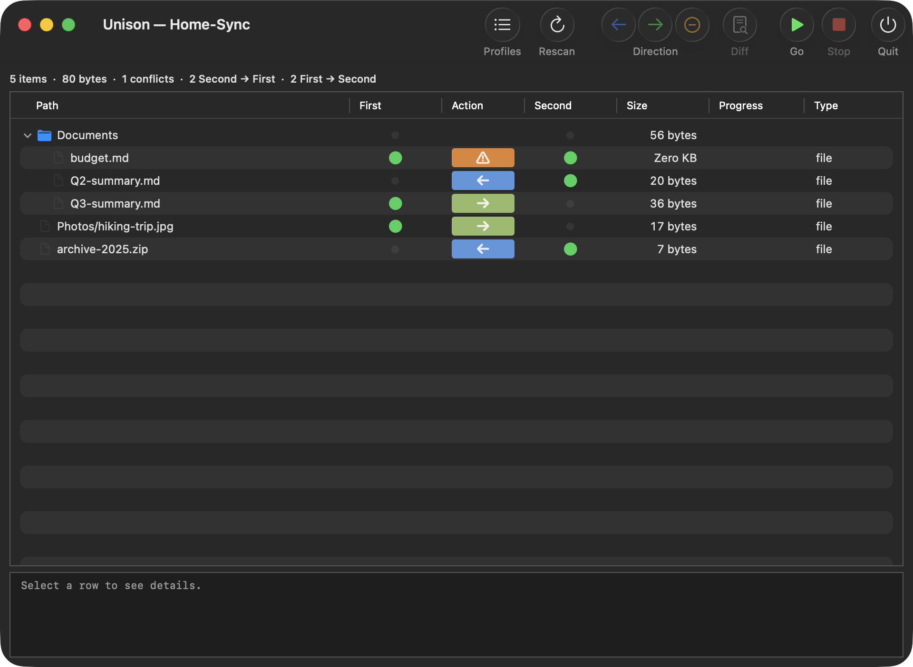
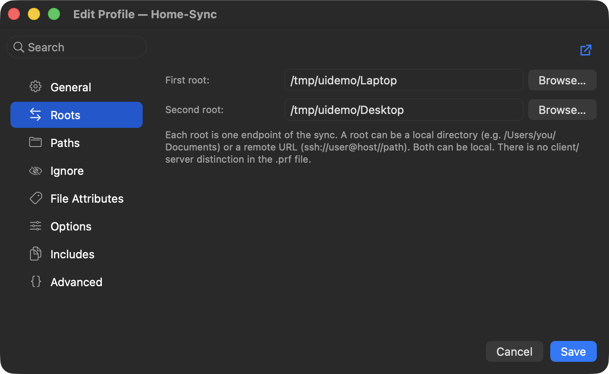
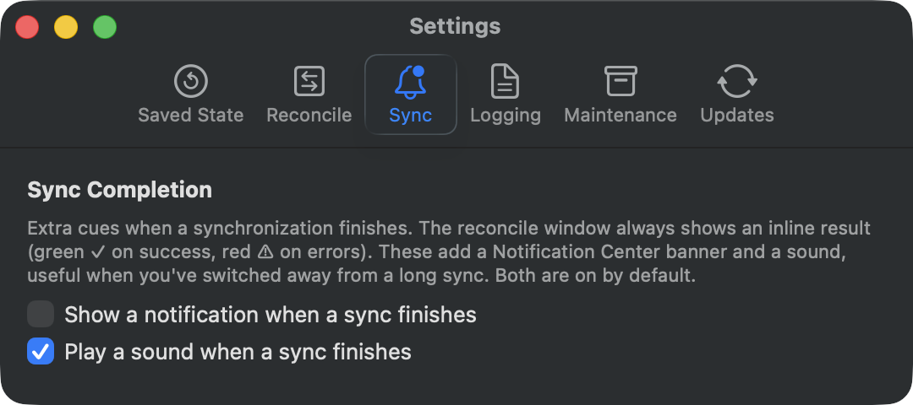
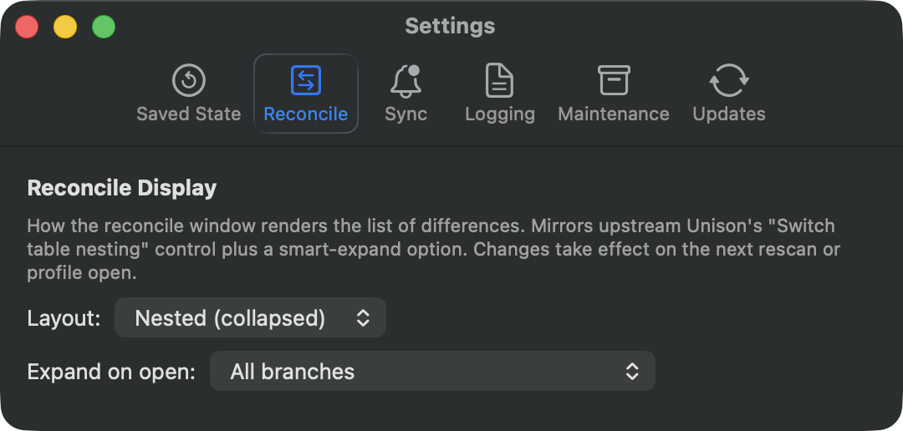

<p align="center">
  <picture>
    <source media="(prefers-color-scheme: dark)" srcset="assets/Unison-macOS-Dark-512x512@1x.png">
    
  </picture>
</p>

# Unison UI for macOS

[](https://github.com/bcourbage/unison-ui-mac/actions/workflows/ci.yml)
[](https://github.com/bcourbage/unison-ui-mac/releases)
[](LICENSE)
[](https://www.apple.com/macos/)
[](#system-requirements)
[](https://github.com/bcpierce00/unison/releases/tag/v2.54.0)

**Unison UI for macOS** is a native macOS GUI for the
[Unison File Synchronizer](https://github.com/bcpierce00/unison): two-way
file synchronization between local folders and remote machines over SSH,
with visual conflict review before synchronized files are changed.

<a id="system-requirements"></a>

- **Requirements:** macOS 15 (Sequoia) or later, Apple Silicon.
- **Free and open source**, released under the GPLv3.

## Install

```sh
brew install --cask bcourbage/tap/unison-ui-mac
```

Other install paths (signed `.app` download, build from source) are in
[INSTALL.md](INSTALL.md).

## Features

- **Two-way synchronization** of files and folders, keeping both sides current.
- **Local and remote roots over SSH** — sync a folder on this Mac against
  another machine.
- **Conflict review** — every proposed change is shown before changes are
  applied to either root, so you decide what wins.
- **Per-item control** — flip the sync direction of any item, or skip it,
  directly in the results.
- **Native macOS GUI** — real menus, notifications, and keyboard control, with
  no terminal required.
- **Self-contained** — the Unison File Synchronizer engine is embedded in the
  app, so the `unison` CLI does not have to be installed separately.
- **Built-in updates** through Sparkle from a cryptographically signed feed;
  release builds are Developer ID-signed and notarized.

## Screenshots

| | |
| :---: | :---: |
| **Review changes before syncing**<br>conflicts and per-item direction<br> | **Configure a profile**<br>local and remote (SSH) roots<br> |
| **Sync notifications**<br>Settings<br> | **Reconcile display**<br>Settings<br> |

For a feature-by-feature guide, see [MANUAL.md](MANUAL.md).
Release history is in [CHANGELOG.md](CHANGELOG.md).

---

## About this project

A native macOS GUI for the Unison File Synchronizer, written in Swift + AppKit.
This is an independent, personal project and is deliberately not intended for
upstream contribution (see [NOTICE.md](NOTICE.md) for the license and
attribution trail, and [CONTRIBUTING.md](CONTRIBUTING.md) for the rules of
engagement on this fork).

> [!IMPORTANT]
> **Bug reports for this UI go to
> [this repo's issues](https://github.com/bcourbage/unison-ui-mac/issues),
> NOT to [upstream Unison](https://github.com/bcpierce00/unison/issues).**
> This is an independent project; upstream maintainers cannot help with UI
> issues, and reports filed there are out of scope for them. The Help menu's
> "Report an Issue" command pre-fills a form pointing at the right place.

## What this is

Upstream Unison ships a Cocoa UI under `src/uimac/` that predates ARC,
Swift, and modern AppKit patterns. This is a fresh-start re-implementation
of the same job: the same OCaml callback protocol (`uimacbridge`) and the
same workflow, written in Swift 6 / AppKit with a programmatic UI, an
XcodeGen-driven project, and no `.xib` files. **It embeds Unison's compiled
OCaml core** (`unison-blob.o`) into the app bundle, so installing the
`unison` CLI on this machine is *not* required for the app to run.

### Unison version

This project embeds upstream Unison at **v2.54.0** (commit `91421d0`,
i.e. `v2.54.0-19-g91421d0`, 19 commits past the `v2.54.0` tag on
`master`). See [`vendor/README.md`](vendor/README.md) for the authoritative
blob provenance.

The compatibility boundary is Unison's **2.52.0 wire protocol**, not an exact
version match: any SSH peer at `>= 2.52.0` interoperates (so `2.53.x` and
`2.54.x` connect fine). The in-app version-mismatch check
(`VersionCheck.swift`) on profile open flags only peers on the *other* side of
that boundary (`< 2.52.0`).

The OCaml core lives as a prebuilt object file under
[`vendor/`](vendor/). See [vendor/README.md](vendor/README.md) for
provenance (upstream commit hash, SHA-256, applied patches) and the
rebuild recipe (`make vendor-blob`). The vendored blob means everyday
builds skip the 5–10 min OCaml compile entirely. When upstream cuts
a new release, the maintainer runs `make vendor-blob` against an
updated upstream checkout to refresh it.

### Remote-side requirement (SSH profiles)

For `ssh://` profiles, the *remote* machine still needs the `unison` CLI
installed because `ssh://` profiles spawn `unison -server` on the far
side. Pure local-to-local profiles (two local directories) have no
external dependency.

The remote `unison` must be at **>= 2.52.0** (Unison's 2.52 wire-protocol
boundary); `2.53.x` and `2.54.x` interoperate with this app's embedded 2.54.0,
while `2.51.x` and earlier cannot connect. Common ways to install it on the
remote:

- **macOS**: `brew install unison`
- **Debian/Ubuntu**: `sudo apt install unison`
- **Other**: upstream install instructions at
  <https://github.com/bcpierce00/unison/wiki/Downloading-Unison>

Source / source-build: <https://github.com/bcpierce00/unison>.

## Status

Functional for the day-to-day sync workflow. Highlights of the current
feature set:

- **Profile management**: profile picker (launch view) plus a dedicated
  Profile Editor manager window with drag-reorder, hide/unhide (UI-only),
  duplicate, delete-to-Trash, and a form editor that surfaces `ignore` and
  `ignorenot` as first-class fields.
- **Reconcile UI**: Finder-style outline view with three configurable
  layout modes (flat / nested-collapsed / nested-full, mirroring
  upstream Unison's "Switch table nesting") + three expand policies
  (smart / all / root-only), color-coded Action column with the user's
  decision visible (forced / skipped / merged badges that hide the
  underlying arrow), status icons in First and Second columns
  (Created / Modified / Deleted / PropsChanged), folder aggregates,
  details footer, ⚠ failure markers with hover-for-reason, tooltips on
  truncated paths, multi-line status disclosure for SSH errors.
- **Per-row actions**: direction overrides (→ Second / ← First / Skip /
  Merge), force older / force newer (mtime-based), ignore-pattern shortcuts
  (Ignore Path / Extension / Name), and inline Diff viewer (unified-diff
  format with green/red/blue per-line coloring).
- **Selection helpers**: Select Conflicts, Revert to Unison's Recommendation.
- **Archive recovery**: reactive (one-click "delete orphans and retry"
  during reconcile fatals) and proactive (`Reset Archives…` in the Profile
  Editor).
- **Extensive unit tests** via `make test`. Pure-logic modules
  (`ReconcileTree`, `ArchiveHash`, `ArchiveRecovery`, `ProfileDocument`,
  `ProfilePreferences`, `RowSelectionRules`, `ReconcileSummary`,
  `SettingsModel`, `ArchiveCleanup`, etc.) carry exhaustive coverage;
  targeted real-AppKit tests cover selected view-controller seams (menu
  construction, settings injection/wiring, password-sheet field style),
  with broader view-controller behavior still exercised by interactive
  testing.

See [TODO.md](TODO.md) for the full prioritized status and what's still
open. The top open item is upstreaming the connection close/reopen support
(rebasing the vendored patches in dependency order); the remainder is mostly
P3 hygiene.

## Build and install

For end-to-end install steps (Xcode/Homebrew prereqs, building, signing,
copying to `/Applications`), see **[INSTALL.md](INSTALL.md)**.

For day-to-day development, the Makefile targets are:

```sh
make build      # Debug build by default. Strips libasmrun's main.n.o,
                # regenerates xcodeproj, runs xcodebuild. Links against
                # the vendored unison-blob.o in vendor/. Pass
                # CONFIG=Release for an optimized build.
make install    # Release build + sign + copy to /Applications
                # (always Release, regardless of CONFIG)
make vendor-blob   # Maintainer-only: rebuild vendor/unison-blob-*.o
                #  from an upstream Unison checkout (needs ../unison/)
make run        # build + launch the binary directly (stderr → terminal)
make app        # build + `open`s the .app (detached, no terminal output)
make test       # XCTest bundle (always Debug)
make open       # opens unison-ui-mac.xcodeproj in Xcode
make clean      # cleans .build/; preserves xcodeproj
make distclean  # also removes the generated xcodeproj
make print-config  # show resolved paths
```

The build links against `vendor/unison-blob-2.54.0-arm64.o`, a
prebuilt OCaml object committed to this repo. No upstream Unison
clone is required for `make build` / `make install`. Builds finish
in a few seconds rather than the 5–10 min that an OCaml-from-source
build would take. Override the blob path on the command line if you
want to test a custom build:
`make build BLOB=/path/to/your/unison-blob.o`.

### Building in Xcode / with bare `xcodebuild`

The `.xcodeproj` is **not** committed; it's generated from
[`project.yml`](project.yml) by XcodeGen, which `make` runs for you.
Run `make build` (or `make xcodeproj`) once; that step bakes the
vendored blob path and OCaml library paths into the generated project,
so afterwards `make open` (or opening `unison-ui-mac.xcodeproj`
directly) and a bare `xcodebuild` both build and link correctly with no
extra flags. A build that somehow runs without those paths set fails
immediately with a clear error pointing back here, rather than
producing a bundle that crashes at launch. Prerequisites for any build:
Xcode, `xcodegen`, and **OCaml 5.5.0 built for the app's macOS deployment
target**. The vendored blob removes the 5–10 min upstream *source* compile,
**not** the OCaml runtime dependency: `make build` still links the app against
the OCaml 5.5.0 runtime libraries (`libasmrun` etc.) and its headers. Two gates
enforce the toolchain: `check-ocaml-version` rejects any version other than
5.5.0, and `verify-runtime-minos` rejects a runtime not built for the deployment
target. On a newer host (e.g. macOS 26) a normally-installed OCaml builds its
runtime for that host, so create a target-built switch — set
`MACOSX_DEPLOYMENT_TARGET=15.0` **before** the compiler is built (a host-built
switch, or a bare `brew install ocaml`, must be rebuilt; the variable does not
repair already-compiled archives). See [INSTALL.md](INSTALL.md#to-build-from-source)
for the exact `opam switch create` recipe. OCaml is additionally needed to
regenerate the blob itself (`make vendor-blob`), a maintainer-only step.

### Local fork patches

This project applies a small set of patches to the upstream Unison
source, currently **five** (see [`patches/`](patches/) and the
authoritative list in [`vendor/README.md`](vendor/README.md)):
`0002` registers a `closeConnection` callback for connection teardown
on leave; `0003` adds `Remote.drainDroppedConnectionThreads` and
drives it from the close paths; `0004` adds transport-child reaper
hooks (the bridge tracks the exact ssh child PID and SIGKILLs it at
teardown; see [`docs/ssh-reaper-design.md`](docs/ssh-reaper-design.md));
`0005` carries a post-sync state snapshot on `syncComplete` to avoid
per-row bridge round-trips; `0006` registers a narrow archive-lock
callback (acquire/release/is-locked over a validated `lk<hash>`) so the
app's archive-mutation transaction takes the same per-archive lock a
live Unison uses. The patches are already baked into the
vendored `unison-blob.o`; you only need to re-apply them if you're
rebuilding the blob from an upstream clone (`make vendor-blob` does this
automatically as a prereq). These patch files are local implementation
and provenance artifacts, not submitted upstream, because they are
LLM-touched (see [NOTICE.md](NOTICE.md) and
[CONTRIBUTING.md](CONTRIBUTING.md)).

## How it works (architecture sketch)

```
+------------------+         +-------------------+        +----------------+
|   Swift / AppKit |  msg →  |   C bridge        |  msg → |   OCaml worker |
| (@MainActor)     |  ←────  |   (UnisonBridgeC) |  ←──── | (uimacbridge)  |
+------------------+         +-------------------+        +----------------+
        ▲                              │
        │ trampolines                  │ pthread mutex+condvar
        │ + DispatchQueue.main.async   │ caml_acquire/release_runtime_system
```

- **Swift→OCaml** synchronous calls go through a single-slot request /
  response handoff serviced by a small pool of three OCaml worker threads.
  Only one worker runs OCaml at a time (the OCaml runtime lock serializes
  them); the extra workers exist so a re-entrant chain
  (C → OCaml → C-callback → Swift → `unison_bridge_*`) finds a free worker
  instead of deadlocking on the single in-flight slot. The active worker
  acquires the runtime lock, runs the requested callback, and signals
  completion on a condvar.
- **OCaml→Swift** callbacks (status, progress, init1/2 complete, per-row
  reload, sync complete, diff, warn, fatal) run inside `CAMLprim` functions
  on the OCaml thread; the Swift trampoline copies any strings
  synchronously then `dispatch_async`s the user handler to the main queue.
- **Modal warn/error** alerts use the condvar dance in reverse: the OCaml
  worker releases the runtime, blocks waiting for a response, and gets woken
  by `unison_bridge_warn_response` / `_fatal_response` after Swift's
  `NSAlert.runModal()` returns.

Per-row OCaml `stateItem` values are kept alive across calls via
`caml_register_generational_global_root`, indexed the same way as the
Swift `[StateItem]` array, so Swift row `i` maps to OCaml `g_ri_roots[i]`.

See [unison/src/uimacbridge.ml](https://github.com/bcpierce00/unison/blob/master/src/uimacbridge.ml)
for the full OCaml-side protocol.

## Project layout

```
unison-ui-mac/
├── project.yml                          XcodeGen project definition
├── Makefile                             Build orchestration
├── README.md                            Orientation and dev build
├── INSTALL.md                           End-user install guide
├── install.sh                           One-shot installer (sign + copy to /Applications + launch)
├── MANUAL.md                            Full user manual (feature guide)
├── NOTICE.md                            Attribution and license details
├── CONTRIBUTING.md                      Contribution policy + LLM-usage disclosure
├── LICENSE                              GPLv3 (full text)
├── TODO.md                              Outstanding work / done items by tier
├── vendor/                              Prebuilt unison-blob.o + provenance
├── patches/                             Local fork patches against upstream Unison
├── Sources/
│   ├── App/                             Swift + AppKit
│   │   ├── main.swift                   NSApplicationMain bootstrap
│   │   ├── AppDelegate.swift            Lifecycle, handler installation, menus
│   │   ├── MainMenu.swift               Programmatic menu bar (Edit, Action, …)
│   │   ├── ProfileWindowController.swift   The picker (launch view)
│   │   ├── ProfileEditorWindowController.swift  Multi-profile manager window
│   │   ├── ProfileFormWindowController.swift    Single-profile content editor
│   │   ├── ProfileDocument.swift        .prf parser / serializer (pure Swift)
│   │   ├── ProfilePreferences.swift     UserDefaults: hide + custom order
│   │   ├── ReconcileWindowController.swift  Outline view + sync UI
│   │   ├── ReconcileToolbar.swift       Toolbar + DirectionAction enum
│   │   ├── ReconcileTree.swift          Tree model + FolderAggregate + RowOverride
│   │   ├── PathCellView.swift           Finder-style folder/file icon + name + tooltip
│   │   ├── StatusIconCellView.swift     First/Second status SF Symbols
│   │   ├── ProgressCellView.swift       Custom-drawn per-row progress bar
│   │   ├── DiffWindowController.swift   Unified-diff viewer
│   │   ├── DirectionAction.swift        (in ReconcileToolbar) per-row direction enum
│   │   ├── IgnoreAction.swift           Ignore Path/Ext/Name enum + menu wiring
│   │   ├── RowSelectionRules.swift      Select Conflicts / Revert pure logic
│   │   ├── ArchiveHash.swift            Pure-Swift port of Update.archiveHash
│   │   ├── ArchiveCleanup.swift         Trash archive files for a hash
│   │   ├── ArchiveRecovery.swift        Reactive recovery for inconsistent state
│   │   ├── PasswordSheet.swift          SSH credential prompts
│   │   ├── StateItem.swift              Swift mirror of OCaml's stateItem
│   │   ├── UnisonBridge.swift           Handler registry + Swift trampolines
│   │   └── TraceLog.swift               os.Logger wrapper (subsystem net.courbage.unison-ui-mac)
│   └── Bridge/
│       ├── UnisonBridgeC.h              C public API
│       └── UnisonBridgeC.c              OCaml↔C glue + thread machinery
├── Tests/                               XCTest bundle
└── Resources/
    ├── Info.plist                       App bundle metadata
    └── Unison.icon/                     Native Icon Composer app icon (light/dark)
```

## License

GNU General Public License v3.0 or later. See [LICENSE](LICENSE) for the
full text and [NOTICE.md](NOTICE.md) for attribution to the upstream Unison
project. This project embeds Unison's compiled object code; as a combined
work it falls under the same license.

## Credits

The entire OCaml synchronization engine comes from the upstream
[Unison File Synchronizer](https://github.com/bcpierce00/unison),
copyright © 1999– Benjamin C. Pierce and contributors. The original Cocoa
UI by Trevor Jim, Craig Federighi, Ben Willmore and others established the
bridge protocol this project follows.

This project was built with substantial LLM assistance and is therefore
**deliberately not** for upstream contribution; see Unison's CONTRIBUTING.md
LLM-usage policy. The compatible-license and downstream-only positioning is
detailed in [NOTICE.md](NOTICE.md).
